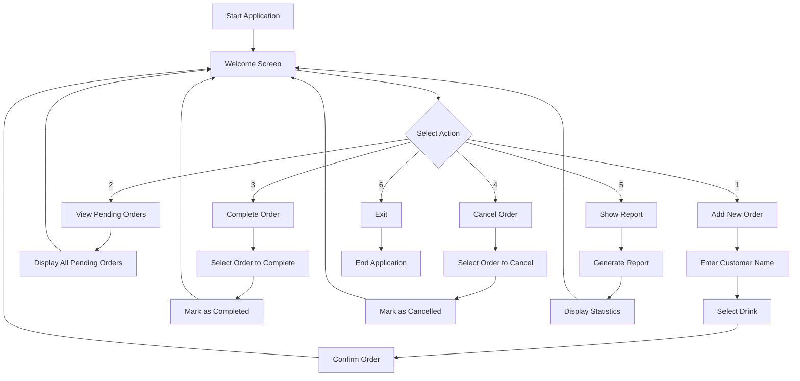
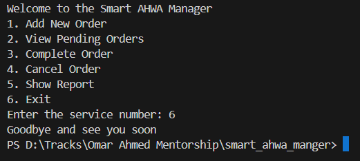
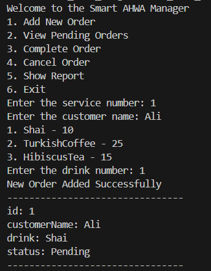
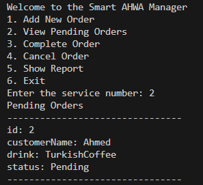
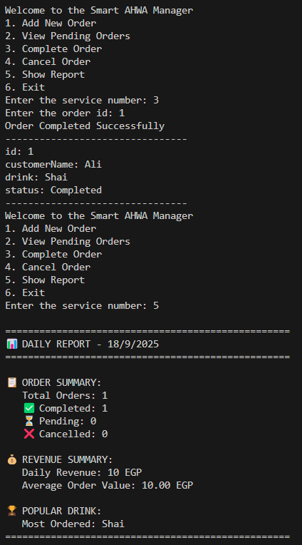
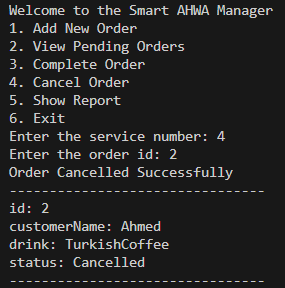
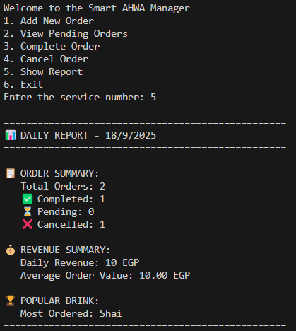
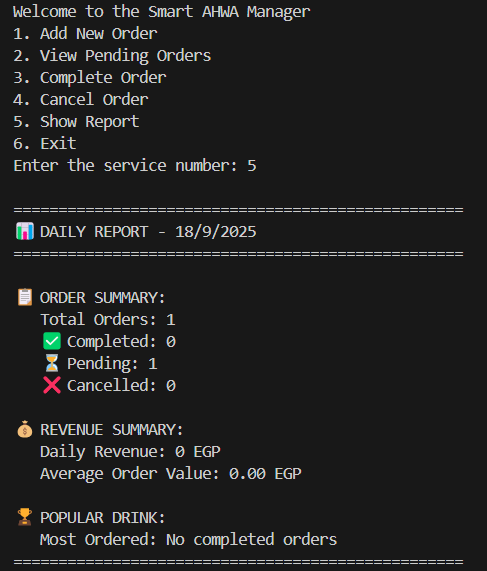
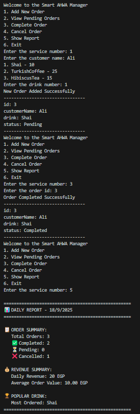

# Smart Ahwa Manager 🍵

A command-line application for managing a traditional Egyptian coffee house (Ahwa) orders. Built with Dart using clean architecture principles and dependency injection.

## 📋 Table of Contents

- [Overview](#overview)
- [Architecture](#architecture)
- [Features](#features)
- [Project Structure](#project-structure)
- [Application Flow](#application-flow)
- [Screen Shots](#screen-shots)
- [Setup & Installation](#setup--installation)
- [Usage](#usage)
- [Technical Details](#technical-details)

## 🎯 Overview

Smart Ahwa Manager is a console-based order management system designed for traditional Egyptian coffee houses. It provides a complete order lifecycle management including order creation, tracking, completion, cancellation, and reporting functionality.

## 🏗️ Architecture

The application follows **Clean Architecture** principles with clear separation of concerns:

```
┌─────────────────────────────────────────────────────────────┐
│                        CLI Layer                            │
│  ┌─────────────────┐ ┌─────────────────┐ ┌─────────────────┐│
│  │  Welcome CLI    │ │   Order CLI     │ │  Report CLI     ││
│  │                 │ │                 │ │                 ││
│  └─────────────────┘ └─────────────────┘ └─────────────────┘│
└─────────────────────────────────────────────────────────────┘
┌─────────────────────────────────────────────────────────────┐
│                     Interface Layer                         │
│  ┌─────────────────┐ ┌─────────────────┐ ┌─────────────────┐│
│  │    Service      │ │  Order I/O      │ │  Report I/O     ││
│  │   Interface     │ │  Interfaces     │ │  Interfaces     ││
│  └─────────────────┘ └─────────────────┘ └─────────────────┘│
└─────────────────────────────────────────────────────────────┘
┌─────────────────────────────────────────────────────────────┐
│                     Service Layer                           │
│  ┌─────────────────┐ ┌─────────────────┐ ┌─────────────────┐│
│  │  Order Service  │ │ Report Service  │ │ Generate Report ││
│  │                 │ │                 │ │    Service      ││
│  └─────────────────┘ └─────────────────┘ └─────────────────┘│
└─────────────────────────────────────────────────────────────┘
┌─────────────────────────────────────────────────────────────┐
│                      Model Layer                            │
│  ┌─────────────────┐ ┌─────────────────┐ ┌─────────────────┐│
│  │     Order       │ │     Drink       │ │  Order Status   ││
│  │                 │ │                 │ │                 ││
│  └─────────────────┘ └─────────────────┘ └─────────────────┘│
└─────────────────────────────────────────────────────────────┘
```

### Architecture Layers:

1. **CLI Layer**: User interface components that handle user interactions
2. **Interface Layer**: Abstract contracts defining system behaviors
3. **Service Layer**: Business logic implementation
4. **Model Layer**: Core data structures and entities

## ✨ Features

- **Order Management**
  - ✅ Add new orders with customer details
  - ✅ View pending orders
  - ✅ Complete orders
  - ✅ Cancel orders

- **Reporting**
  - ✅ Generate comprehensive reports
  - ✅ View order statistics
  - ✅ Track revenue and performance

- **Drink Menu**
  - ☕ Shai (Traditional Tea) - 10 EGP
  - ☕ Turkish Coffee - 25 EGP
  - 🌺 Hibiscus Tea - 15 EGP

## 📁 Project Structure

```
smart_ahwa_manger/
├── bin/
│   └── smart_ahwa_manger.dart          # Application entry point
├── lib/
│   ├── cli/                            # Command Line Interface
│   │   ├── welcome_cli.dart            # Main menu CLI
│   │   ├── add_new_order_cli.dart      # Add order interface
│   │   ├── view_pending_order_cli.dart # View orders interface
│   │   ├── complete_order_cli.dart     # Complete order interface
│   │   ├── cancel_order_cli.dart       # Cancel order interface
│   │   ├── cli_order_input.dart        # Order input handler
│   │   ├── cli_order_output.dart       # Order output handler
│   │   ├── cli_report_output.dart      # Report output handler
│   │   ├── cli_service_input.dart      # Service input handler
│   │   └── cli_service_output.dart     # Service output handler
│   ├── interfaces/                     # Abstract Contracts
│   │   ├── service.dart                # Service interface
│   │   ├── order_input.dart            # Order input interface
│   │   ├── order_output.dart           # Order output interface
│   │   ├── report_output.dart          # Report output interface
│   │   ├── service_input.dart          # Service input interface
│   │   └── service_output.dart         # Service output interface
│   ├── models/                         # Data Models
│   │   ├── order.dart                  # Order entity
│   │   ├── drink.dart                  # Drink entities
│   │   └── order_status.dart           # Order status enum
│   └── services/                       # Business Logic
│       ├── services.dart               # Service implementations
│       ├── order_service.dart          # Order management logic
│       ├── report_service.dart         # Report generation logic
│       └── generate_report_service.dart # Report service coordinator
├── screens/                            # Application Screenshots
└── pubspec.yaml                        # Project dependencies
```

## 🔄 Application Flow



## 📱 Screen Shots

### Main Welcome Screen

*The main menu showing all available operations*

### Add New Order

*Interface for creating new customer orders*

### View Pending Orders

*Display of all orders awaiting completion*

### Complete Order

*Interface for marking orders as completed*

### Cancel Order

*Interface for cancelling existing orders*

### Generate Reports

*Comprehensive reporting dashboard*


*Detailed report view with statistics*


*Report generation completion screen*

## 🚀 Setup & Installation

### Prerequisites
- Dart SDK ^3.9.0
- Git

### Installation Steps

1. **Clone the repository**
   ```bash
   git clone <repository-url>
   cd smart_ahwa_manger
   ```

2. **Install dependencies**
   ```bash
   dart pub get
   ```

3. **Run the application**
   ```bash
   dart run
   ```

## 💻 Usage

1. **Start the application**
   ```bash
   dart run bin/smart_ahwa_manger.dart
   ```

2. **Navigate through the menu** using number selections (1-6)

3. **Follow the prompts** for each operation:
   - **Add Order**: Enter customer name and select drink
   - **View Orders**: Browse all pending orders
   - **Complete Order**: Select order ID to mark as complete
   - **Cancel Order**: Select order ID to cancel
   - **Show Report**: View comprehensive statistics
   - **Exit**: Close the application

## 🔧 Technical Details

### Design Patterns Used
- **Command Pattern**: Each menu option is implemented as a service
- **Strategy Pattern**: Different drink types implement the same interface
- **Dependency Injection**: Services are injected into CLI components
- **Interface Segregation**: Separate interfaces for input/output operations

### Key Classes

#### Models
- `Order`: Represents a customer order with ID, customer name, drink, and status
- `Drink`: Abstract class implemented by `Shai`, `TurkishCoffee`, `HibiscusTea`
- `OrderStatus`: Enum for order states (pending, completed, cancelled)

#### Services
- `OrderService`: Manages order CRUD operations
- `ReportService`: Handles report generation logic
- `GenerateReportService`: Coordinates report creation and display

#### CLI Components
- `WelcomeCli`: Main menu controller
- Various CLI classes for specific operations
- Input/Output handlers for user interaction

### Dependencies
- `path: ^1.9.0` - Path manipulation utilities
- `collection: ^1.18.0` - Enhanced collection operations

## 🎯 Object-Oriented Design Principles

The Smart Ahwa Manager exemplifies core Object-Oriented principles from "The Object-Oriented Thought Process," demonstrating how proper abstraction, encapsulation, inheritance, and polymorphism create maintainable, scalable software. **Abstraction** is achieved through well-defined interfaces like `Service`, `Drink`, and various I/O contracts that hide implementation complexity while exposing only essential operations—allowing the CLI layer to interact with business logic without knowing internal details. **Encapsulation** is evident in the `Order` class, which protects its internal state through private fields and controlled access methods, ensuring data integrity while providing a clean public interface. The **modular architecture** separates concerns across distinct layers (CLI, Services, Models, Interfaces), enabling independent development, testing, and modification of components without affecting the entire system.

**Inheritance and Polymorphism** shine through the `Drink` hierarchy, where `Shai`, `TurkishCoffee`, and `HibiscusTea` inherit from the abstract `Drink` class, allowing the system to treat all beverages uniformly while maintaining their unique characteristics—this polymorphic behavior enables easy menu expansion without modifying existing code. The **Command Pattern** implementation through the `Service` interface demonstrates how object-oriented thinking transforms user actions into executable objects, making the system highly extensible. These principles matter critically in this context because they enable the coffee house management system to evolve—new drink types can be added without breaking existing functionality, new services can be integrated seamlessly, and the CLI can be replaced with a GUI without touching business logic. This design reflects the object-oriented mindset of modeling real-world entities (orders, drinks, services) as software objects with clear responsibilities, relationships, and behaviors, resulting in code that mirrors the problem domain and remains comprehensible to both developers and stakeholders.

---

**Built with ❤️ using Dart and Clean Architecture principles**

*Smart Ahwa Manager - Bringing traditional coffee house management into the digital age*